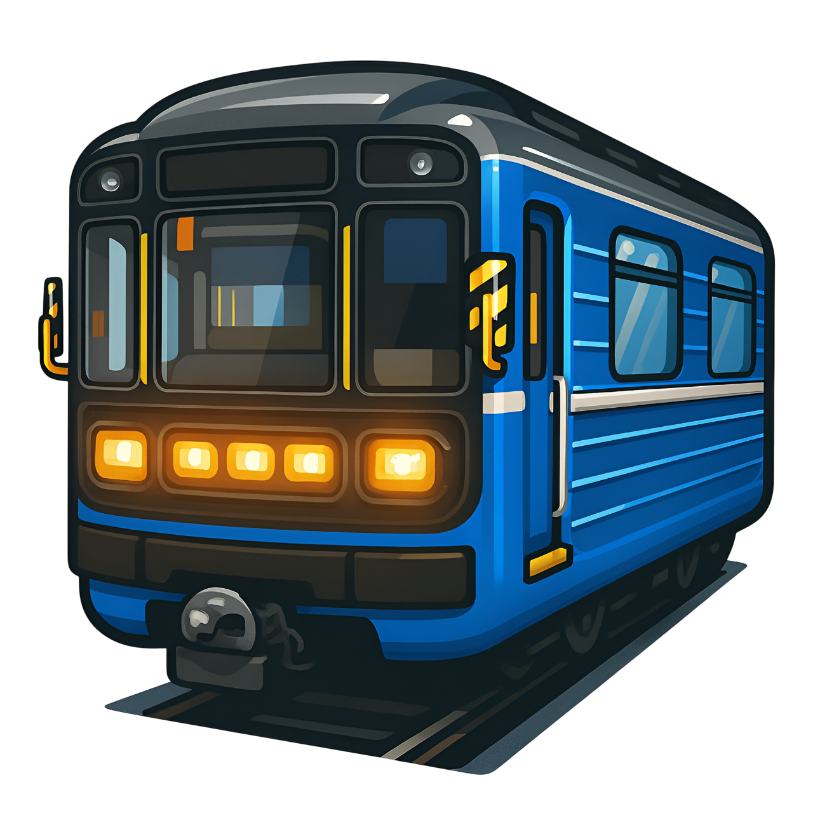

<h1>
  
  metro3d.ru — интерактивные схемы метро
</h1>

<!-- Навигация по языкам (якоря ссылаются на явные id заголовков ниже) -->
> 🇷🇺 [Русская версия](#russian-version) | 🇬🇧 [English version](#english-version)

---

<h2 id="russian-version">🇷🇺 Русская версия</h2>

### 🗺 О проекте
**[www.metro3d.ru](https://metro3d.ru)** — это интерактивная 3D-схема метрополитенов России.  

### 🧭 Цель репозитория
Делать данные **точными и актуальными**. Сайт берет данные напрямую из `data.json`. Данные первоначально были собраны из более чем 3000+ источников при помощи поисковых систем Google и Яндекс, в последующем огромный массив данных был обработан последовательно несколько раз с помощью Grok, ChatGPT и Qwen с целью приведения к медианным (предположительно правдивым, но это не точно) результатам. Лишь часть данных были проверены вручную (малые города и часть станций Москвы). Поэтому на картах могут быть ошибки. Если вы заметили неточность (например, смещённую станцию, неверную глубину, опечатку в названии) — создайте *issue* (*проблему*) в этом репозитории. Если правок много, то можете сделать пул реквест.


### 🤝 Как помочь

Для проверки ошибки проще работать с issues, потому что проще записывать и проверять источники. Поэтому если есть что поправить, даже если много, пожалуйста, постарайтесь это занести в именно в данный раздел. Да и к тому же уже по какой-то станции или ветке могла быть создана проблема, поэтому **перед созданием issue проверьте, может быть по объекту уже была создана ветка обсуждений, и тогда пишите в ней**. Спасибо за понимание.

- Найдите issue по станции или ветке. Если такого нет, то создайте новый issue с меткой `edits`. 
Опишите проблему и приложите ожидаемое значение (координаты в формате `lat, lon`, корректную глубину в метрах и т. п.). Например:  
```
Проблема: у станции "Площадь Гагарина" в Москве неверные координаты. 
Ожидаемые: 55.706500, 37.585100. 
Источник взял из Яндекс карт.
```
или
```
Высота заложения станции "Геологическая" в Екатеринбурге указана неверно.
В источнике N указано значение X метров.
``` 
- Или сделайте Fork → внесите правки в JSON → откройте Pull Request. В PR укажите источники данных (ссылки) и краткое обоснование правки.

**ВАЖНО! Указывайте ссылки на источники или описывайте подробно логические обоснования, следующие из косвенных фактов, которые тоже нужно подкрепить источниками**.  

### 📁 Структура репозитория
- `data.json` — JSON-объект данных метрополитенов разных городов с названиями, координатами и высотами заложения станций
- `logo.png` — логотип сайта (основан на поезде метро Екатеринбурга модели 81-717/714)
- `README.md` — этот файл

### 📄 Лицензия / License


Данные, используемые в этом репозитории, предоставляются под лицензией [Open Data Commons Attribution License (ODC-By 1.0)](https://opendatacommons.org/licenses/by/1-0/).

Вы можете:
- Копировать, использовать и распространять данные;
- Изменять данные под свои нужды;

**Условие:** обязательно указание источника: [metro3d.ru](https://metro3d.ru)

> ⚠️ Данные предоставляются для **некоммерческого использования**. 

---

<h2 id="english-version">🇬🇧 English version</h2>

### 🗺 About the project
**[www.metro3d.ru](https://metro3d.ru)** is an interactive 3D map of Russian metro systems.  

### 🧭 Repository purpose
The goal is to keep the data **accurate and up-to-date**. The website fetches data directly from `data.json`.  
Initially, the data was collected from over 3000 sources using Google and Yandex search engines. Later, the large dataset was processed multiple times using Grok, ChatGPT, and Qwen to bring values closer to median estimates (presumably accurate, but not guaranteed). Only a portion of the data has been manually verified (small cities and some Moscow stations). Therefore, errors may exist on the maps.  
If you notice an inaccuracy (e.g., a misaligned station, wrong depth, or typo in the name) — please create an *issue* in this repository. For many corrections, feel free to make a pull request.

### 🤝 How to help
It is easier to track and verify corrections through issues. If you find something to correct, please use this approach first. Some stations or lines may already have an open issue, so **check before creating a new one and contribute to existing discussions**. Thank you for understanding.

- Search for an issue by station or line. If none exists, create a new issue labeled `edits`.  
Describe the problem and provide the expected values (coordinates in `lat, lon` format, correct depth in meters, etc.). For example:  

```
Problem: The station "Ploshchad Gagarina" in Moscow has incorrect coordinates.
Expected: 55.706500, 37.585100.
Source: Yandex Maps.
```

or

```
The depth of "Geologicheskaya" station in Yekaterinburg is incorrect.
Source N shows X meters.
```

- Or make a Fork → edit the JSON → open a Pull Request. In PR, indicate data sources (links) and a short justification for changes.

**IMPORTANT! Always provide sources or detailed logical justification, including indirect evidence supported by references**.  

### 📁 Repository structure
- `data.json` — JSON object of metro systems in various cities with station names, coordinates, and depths
- `logo.png` — website logo (based on the Yekaterinburg metro train model 81-717/714)
- `README.md` — this file

### 📄 License
The data in this repository is released under the [Open Data Commons Attribution License (ODC-By 1.0)](https://opendatacommons.org/licenses/by/1-0/).

You are free to:
- Copy, use, and share the data;
- Modify the data for your own purposes;

**Condition:** always give credit to the source: [metro3d.ru](https://metro3d.ru)

> ⚠️ Data is provided for **non-commercial use only**.

